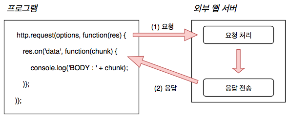
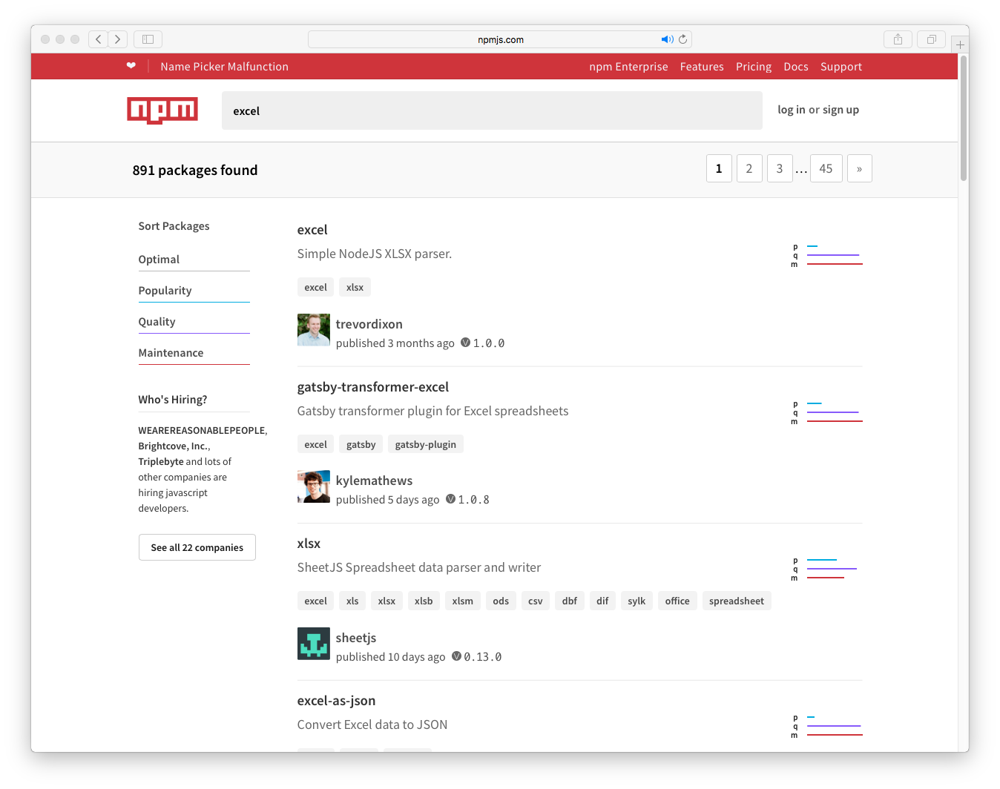
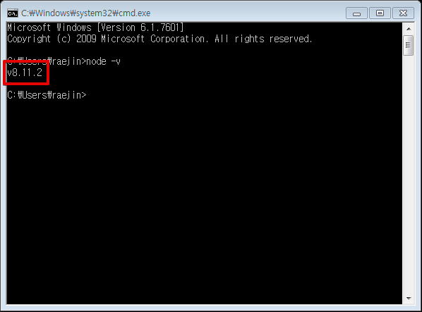

# Node.js 프로그래밍 해설

**작성자** : 정래진 (jrj8819@naver.com)

**작성일** : 2018.06.11

**참조**

- 정재곤미크, *Do it Node.js 프로그래밍*, 이시스퍼블리싱, 2017


##  Chapter 1. Node.js는 무엇인가?

Node.js(이하 노드)는 2009년 라이언 달(Ryan Dahl)이 만들었다. 그 당시에는 웹 서버에 파일을 업로드 할 때 업로드가 완료되기 전까지 웹 서버에서 데이터를 조회한다거나 하는 등의 작업을 할 수 없다. 이 문제를 해결하기 위해 새로운 방식의 서버 개발 도구를 만들기 시작한 것이 노드이다.


웹 서버는 작업을 수행하기 위해 핸들러(Handler)를 하나 만들어 활용한다. 파일 업로드 작업을 완료하기 전에는 서버에 있는 다른 파일의 정보를 확인하거나 파일 업로드가 어떻게 진행되고 있는지 요청하는 것이 불가능해서 업로드가 완료될 때까지 대기해야 한다. 당시 웹 서버의 파일 업로드 핸들러가 하나의 요청이 끝날 때 까지 다른 요청을 대기시켜 응답시간이 길어지거나, 서버에서 처리해야하는 요청의 수가 증가하면 CPU나 메모리 사용량도 크게 증가하는 문제가 많이 발생하였다.


### 1-1. 노드의 동작 방식

앞에서 이야기한 문제를 해결하기 위해 노드는 하나의 요청 처리가 끝날 때까지 기다리지 않고 다른 요청을 동시에 처리할 수 있는 비동기 입출력 방식(논블로킹 입출력, Non-Blocking IO)을 적용하여 설계되었다. 비동기 입출력 방식은 노드의 가장 큰 특징이으로 이를 근본적으로 이해하려면 동기 입출력 방식(블로킹 입출력, Blocking IO)으로 파일을 처리하는 과정을 알아야 한다.


#### 1-1-1. 동기 입출력 방식

프로그램이 먼저 파일 시스템에 읽기 요청을 한다. 이때 파일 시스템에서는 디스크에 있는 파일을 확인하고 준비한 다음 처리하는 시간이 필요한데 그동안 프로그램은 다른 작업을 진행하지 않고 대기하게 된다. 프로그램이 파일의 내용을 얽어 그 내용을 처리한 다음에야 다른 작업을 진행할 수 있는 것이다. 결국 프로그램을 실행하는 중간 대기 시간이 발생하면서 속도가 느려지는 문제가 발생한다.


```javascript
var contents = file.read('a.txt');

/*
	대기
*/

doShow(contents);

var result = doAdd(10,10);
```


#### 1-1-2. 비동기 입출력 방식

'비동기 방식으로 처리한다'라는 것은 파일 시스템에 읽기 요청을 한 후에 프로그램이 대기하지 않고 다른 작업을 진행한다는 것을 의미한다. 프로그램에서 해당 파일의 내용을 처리할 수 있는 시점이 되면, **콜백함수(Callback Function)**가 호출된다. 프로그램에서는 파일 읽기 요청을 하기 전에 콜백함수를 등록하는데, 파일 시스템은 파일 처리가 끝나면 자동으로 콜백함수를 호출한다. 따라서 프로그램이 파일 읽기 작업이 끝날 때까지 대기하지 않아도 파일을 다 읽은 시점에서 통보를 받고 파일의 내용을 보여주는 작업을 진행할 수 있다.


```javascript
file.read('a.txt');

var result = doAdd(10,10);

function(contents) {
    doShow(contents);
}
```


#### 1-1-3. 노드에서 구현하는 이벤트 기반 입출력 방식

위의 동기/비동기 입출력 방식에 대한 이론을 바탕으로 노드는 비동기 방식을 사용하는 이벤트 기반 입출력 모델(Event driven, Non-blocking I/O model)으로 만들어졌다. 파일 시스템에서 파일 읽기가 완료되었다는 이벤트만 전달하면 그 이벤트를 받아 미리 작성된 콜백함수를 실행시킨다. 이를 통해 노드에서 사용하는 이 모델은 상당히 가볍고 효율적이며, 많은 데이터를 주고받는 실시간 프로그램에서 큰 효과를 발휘할 수 있다.

노드 프로그램이 동작할 수 있도록 구성되어 있으며, 그 중 가장 중요한 부분 중 하나가 이벤트를 받아 처리하는 기능이다. 특히 노드는 서버 쪽에서 동작하는 프로그램을 만드는 것이기 때문에 기본 기능인 소켓(Socket) 이나 HTTP 프로토콜을 사용해 데이터를 송수신하는 기능을 포함하고 있다.

다음은 http를 이용해 웹 서버로 요청을 보내고 응답을 받는 코드의 일부이다.




#### 1-1-4. 노드를 더 쉽게 사용할 수 있게 하는 모듈

소스 파일 하나에 실행하려는 기능이 모두 있다면, 코드의 양이 많을 뿐만 아니라 이해하기 어려워진다. 이를 해소하기 위해 일부 기능을 별도의 파일로 때내어 만들어 관리하고 필요할 때 불러 사용할 수 있다.


자바 스크립트 파일의 일부 코드를 떼어 별도의 파일로 만들 수 있는데 이 것을 모듈(Module)이라고 한다. 이 모듈을 사용하고 싶다면 require() 함수로 모듈을 호출하면 된다. 불러들인 파일은 자바스크립트 객체로 인식되며, 그 객체를 참조하여 파일에 넣어 둔 기능을 사용할 수 있다.

이렇게 여러 프로그램에서 공통으로 사용하는 기능을 모듈로 분리하여 구성하는 것이 일반적이다. 여러 개의 모듈을 합쳐서 하나의 패키지(Package)로 만들어 놓으면 다른 프로젝트에서도 NPM(Node Package Manager)으로 패키지를 설치하여 사용할 수 있다.




## Chapter 2. 노드 설치하기

#### 2-1-1. 설치 하기

- 노드의 공식 사이트(https://nodejs.org) 에 접속하고 다운로드 받는다.


- 다운로드 받은 설치파일을 실행하고 Next 버튼을 선택한다.


- 라이센스에 동의한다.


- Next 버튼을 선택한다.


- Change를 선택하여 Node를 설치할 경로를 설정하고 Next 버튼을 선택한다.


- 옵션을 모두 설치하는 것으로 설정하고, Next 버튼을 선택한다.


- Install 버튼을 선택하여 설치한다.


- Finish 버튼을 선택하여 설치를 마무리하자.


#### 2-1-2. 설치 확인하기

- 설치 후에 (윈도우 기준) 층시작 > 실행 > cmd 입력 > 명령 프롬프트 실행


- 명령어 실행

```shell
node -v
```

설치한 Node의 버전이 나타나면 정상적으로 설치된 것이다.



