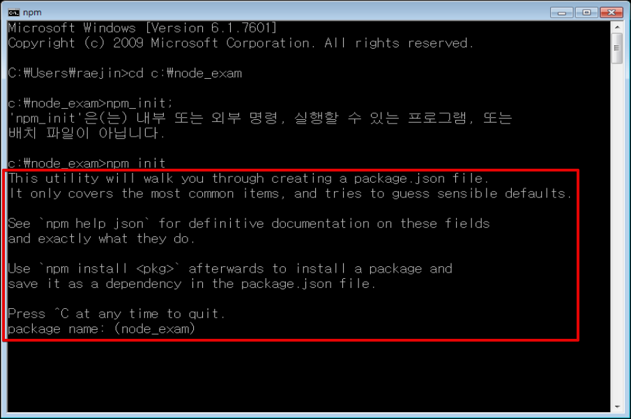

# Node.js 프로그래밍 해설

**작성자** : 정래진 (jrj8819@naver.com)

**작성일** : 2018.06.11

**참조**

- 정재곤미크, *Do it Node.js 프로그래밍*, 이시스퍼블리싱, 2017


## Chapter 3. 웹 서버 만들기

노드에 기본으로 들어 있는 http 모듈을 사용하면 웹 서버 기능을 담당하는 서버 객체를 만들 수 있다. http 모듈을 로딩했을 때 서버를 만드는 createServer() 메소드를 활용하여 서버 객체를 만들 수 있다. 일단 다음 코드를 한번 실행해 보자.

```javascript
var http = require('http');

// 웹 서버 객체를 만듭니다.
var server = http.createServer();

// 웹 서버를 시작하여 3000번 포트에서 대기하도록 합니다.
var port = 3000;
server.listen(port, function() {
	console.log('웹 서버가 시작되었습니다. : %d', port);
});
```


웹 서버는 일반적으로 웹 브라우저라고 하는 클라이언트에서 HTTP 프로토콜로 요청한 정보를 처리한 후 응답을 보내주는 역할을 한다. 이때 60000개가 넘는 포트 중에서 하나를 사용하는데 여기서는 3000번 포트를 사용한다.

웹 서버를 만들어 실행하는 과정에서 먼저 http모듈의 createServer() 메소드를 활용해 웹 서버 객체를 만들고, 객체의  listen() 메소드를 호출하여 특정 포트에서 사이트 요청을 기다린다.

| 메소드 이름                                      | 설명                            |
| ------------------------------------------------ | ------------------------------- |
| listen(port, [hostname], [backlog], [callback]); | 서버를 실행하여 대기하는 메소드 |
| close([callback]);                               | 서버를 종료하는 메소드          |


다음은 별도로 IP주소를 활용할 때의 코드이다. 참고사항으로 알아 두자.

```javascript
var http = require('http');

// 웹 서버 객체를 만듭니다.
var server = http.createServer();

//웹 서버를 시작하여 192.168.0.5 IP와3000번 포트에서 대기하도록 만들고 싶다면 아래 코드를 참조합니다.
var host = '192.168.0.5';
var port = 3000;
server.listen(port, host, '50000', function() {
	console.log('웹 서버가 시작되었습니다. : %s, %d', host, port);
});
```


### 3-1. 클라이언트가 웹 서버에 요청할 때 발생하는 이벤트 처리하기

앞의 내용은 서버가 아무것도 하는 일이 없다. 서버에게 일을 시키기 위해서는 웹 브라우저가 웹 서버에 접속한 후 데이터를 요청하면 그때마다 적절한 이벤트가 발생하므로 다양한 상황에 맞추어 콜백 함수를 각각 등록하면 된다. 다음은 서버 객체에서 사용할 수 있는 주요 이벤트이다.

| 이벤트 이름 | 설명                                                     |
| ----------- | -------------------------------------------------------- |
| connection  | 클라이언트가 접속하여 연결이 만들어질 때 발생하는 이벤트 |
| request     | 클라이언트가 요청할 때 발생하는 이벤트                   |
| close       | 서버를 종료할 때 발생하는 이벤트                         |


```javascript
var http = require('http');

// 웹서버 객체를 만듭니다.
var server = http.createServer();

// 웹서버를 시작하여 3000번 포트에서 대기하도록 합니다.
var port = 3000;
server.listen(port, function() {
	console.log('웹서버가 시작되었습니다. : %d', port);
});

// 클라이언트 연결 이벤트 처리
server.on('connection', function(socket) {
	console.log('클라이언트가 접속했습니다. : %s, %d', socket.remoteAddress, socket.remotePort);
});

// 클라이언트 요청 이벤트 처리
server.on('request', function(req, res) {
	console.log('클라이언트 요청이 들어왔습니다.');
	console.dir(req);
});

// 서버 종료 이벤트 처리
server.on('close', function() {
	console.log('서버가 종료됩니다.');
});
```

 

웹 브라우저와 같은 클라이언트가 웹 서버에 연결되면 connection 이벤트가 발생한다. 그러므로 on() 메소드를 호출할 때 첫 번째 파라미터로 connection 이벤트 이름을 전달하고, 두 번째 파라미터로 콜백함수를 전달한다. 연결이 만들어져 콜백함수가 호출될 때는 socket 객체가 파라미터로 전달됨을 주목하자. 이 객체는 클라이언트 연결 정보를 담고 있으므로, 안에 address() 메소드를 호출하여 클라이언트 IP와 포트 정보를 확인할 수 있다.

클라이언트가 특정 주소로 요청을 하면 request 이벤트가 발생한다. 이때도 앞에서 알아본 것처럼 on() 메소드를 사용해 이벤트를 처리한다. 콜백 메소드로 전달되는 요청 객체를 console.dir() 메소드로 화면에 출력하면 어떤 정보가 들어 있는지 확인할 수 있다.


서버는 클라이언트가 접속했는지 확인 할 수 있지만, 클라이언트는 아무런 표시가 없다. 이는 서버에서 아무런 응답을 보내주지 않기 때문이다. 서버에서 응답을 보내도록 request 이벤트를 처리하는 콜백함수 안에 다음과 같이 입력하자.

```javascript
var http = require('http');

// 웹서버 객체를 만듭니다.
var server = http.createServer();

// 웹서버를 시작하여 3000번 포트에서 대기하도록 합니다.
var port = 3000;
server.listen(port, function() {
	console.log('웹서버가 시작되었습니다. : %d', port);
});

// 클라이언트 연결 이벤트 처리
server.on('connection', function(socket) {
	console.log('클라이언트가 접속했습니다. : %s, %d', socket.remoteAddress, socket.remotePort);
});

// 클라이언트 요청 이벤트 처리
server.on('request', function(req, res) {
	console.log('클라이언트 요청이 들어왔습니다.');
	
	res.writeHead(200, {"Content-Type": "text/html; charset=utf-8"});
	res.write("<!DOCTYPE html>");
	res.write("<html>");
	res.write("  <head>");
	res.write("    <title>응답 페이지</title>");
	res.write("  </head>");
	res.write("  <body>");
	res.write("    <h1>노드제이에스로부터의 응답 페이지</h1>");
	res.write("  </body>");
	res.write("</html>");
	res.end();
	  
});

// 서버 종료 이벤트 처리
server.on('close', function() {
	console.log('서버가 종료됩니다.');
});
```


request 이벤트의 콜백함수에 매개변수로 있는 res객체의 writeHead(), write(), end() 메소드를 사용하면 클라이언트로 응답을 보낼 수 있다. 이 중에서 end() 메소드는 응답을 모두 보냈다는 것을 의미하며, 일반적으로는 end() 메소드가 호출 될 때 클라이언트로 응답을 전송한다.

지금까지 노드로 만든 기능을 정리하면 다음과 같다.


on() 메소드는 이벤트를 처리할 때 사용하는 가장 기본적인 메소드이다. 이 메소드로 connection, request, close 이벤트를 처리할 수 있는 콜백 함수를 각각 등록해 두면 상황에 맞게 자동 호출된다. 클라이언트가 요청을 해 왔을 때 발생하는 request 이벤트를 처리할 수 있게 등록해 둔 콜백 함수에서는 res 객체를 사용하여 클라이언트로 응답을 보낸다. res 객체를 사용하여 응답을 보낼 때 사용하는 주요 메소드는 다음과 같다.

| 메소드 이름                                        | 설명                                                         |
| -------------------------------------------------- | ------------------------------------------------------------ |
| writeHead(statusCode, [statusMessage], [headers]); | 응답으로 보낼 헤더를 만든다.                                 |
| write(chunk, [encoding], [callback]);              | 응답 본문(body) 데이터를 만든다. 여러번 호출 할 수 있다.     |
| end([data], [encoding], [callback]);               | 클라이언트로 응답을 전송한다. 파라미터에 데이터가 들어 있다면 이 데이터를 포함시켜 응답을 전송한다. 클라이언트의 요청이 있을 때 한 번은 호출되어야 응답이 전달되며, 콜백 함수가 지정되면 응답이 전송된 후 콜백 함수가 호출된다. |


request 이벤트를 처리하는 콜백 함수에서 클라이언트로 응답을 보내는 방법에 대해 알아보았다. request 이벤트를 사용하여 클라이언트로 응답을 보내지 않고 서버 객체를 만들 때 사용한 createServer() 메소드 호출 부분에 응답을 보내는 코드를 바로 입력할 수도 있다.

```javascript
var http = require('http');

// 웹서버 객체를 만듭니다. - 클라이언트 요청을 처리하는 콜백 함수를 파라미터로 전달합니다.
var server = http.createServer(function(req, res) {
	console.log('클라이언트 요청이 들어왔습니다.');
	
	res.writeHead(200, {"Content-Type": "text/html; charset=utf-8"});
	res.write("<!DOCTYPE html>");
	res.write("<html>");
	res.write("  <head>");
	res.write("    <title>응답 페이지</title>");
	res.write("  </head>");
	res.write("  <body>");
	res.write("    <h1>노드제이에스로부터의 응답 페이지</h1>");
	res.write("  </body>");
	res.write("</html>");
	res.end();
});

// 웹서버를 시작하여 3000번 포트에서 대기하도록 합니다.
var port = 3000;
server.listen(port, function() {
	console.log('웹서버가 시작되었습니다. : %d', port);
});

// 클라이언트 연결 이벤트 처리
server.on('connection', function(socket) {
	console.log('클라이언트가 접속했습니다. : %s, %d', socket.remoteAddress, socket.remotePort);
});

// 서버 종료 이벤트 처리
server.on('close', function() {
	console.log('서버가 종료됩니다.');
});
```


### 3-2. 익스프레스로 웹 서버 만들기

http 모듈만 사용하여 웹 서버를 구성할 때는 많은 것들을 직접 만들어야 한다. 하지만 직접 만들어야 하는 코드가 많다면 시간과 노력도 많이 든다는 문제가 생긴다. 이 문제를 해결하기 위해 만들어진 것이 익스프레스(Express)이다. express 모듈을 사용하면 간단한 코드로 웹 서버의 기능을 구현할 수 있다. 특히 익스프레스에서 제공하는 미들웨어와 라우터를 사용하면 서버의 기능을 편리하게 구성할 수 있다.


#### 3-2-1. 새로운 익스프레스 서버 만들기

명령 프롬프트를 실행하여 예제 파일이 있는 경로로 이동하자.

- 윈도우

```shell
cd [예제 파일 경로]
```


- 명령 프롬프트에서 다음 명령어를 작성하여 package.json 파일을 생성하자.

```shell
npm init
```


- 별도로 입력을 요구하지만 enter키를 눌러 지나가면 자동으로 괄호안의 값이 입력된다.




- 완료된 모습


- 예제 폴더를 열어보면 package.json 파일이 존재하고, 열어보면 다음과 같이 내용이 적혀있다.


- brackets 에서 app.js 파일을 만들고 다음 코드를 작성하자.

```javascript
var express = require('express')
var http = require('http');
 
// 익스프레스 객체 생성
var app = express();

// 기본 포트를 app 객체에 속성으로 설정
app.set('port', process.env.PORT || 3000);

// Express 서버 시작
http.createServer(app).listen(app.get('port'), function(){
  console.log('익스프레스 서버를 시작했습니다 : ' + app.get('port'));
});
```


필요한 모듈을 읽어 오고 다음 줄을 살펴보면 express() 함수를 호출하여 반환된 객체를 app 변수에 저장하였다. 다음으로 app.set() 메소드를 통해, 서버 설정을 위한 속성을 지정한다. 마지막으로 http 모듈에 정의된 createServer() 메소드에서 파라미터로 설정이 저장된 app 객체를 전달한다. 이 후 listen() 메소드를 호출하면 웹서버가 실행된다.

여기서 app 객체는 express() 메소드 호출로 만들어진 익스프레스 서버 객체로 주요 메소드들은 다음과 같다.

| 메소드 이름                        | 설명                                                         |
| ---------------------------------- | ------------------------------------------------------------ |
| set(name, value);                  | 서버 설정을 위한 속성을 지정한다. set() 메소드로 지정된 속성은 get()메소드로 꺼내어 확인할 수 있다. |
| get(name);                         | 서버 설정을 위해 지정한 속성을 꺼내 온다.                    |
| use([path], function, [function]); | 미들웨어 함수를 사용한다.                                    |
| get([path], function);             | 특정 패스로 요청된 정보를 처리한다.                          |


여기서 set() 메소드를 살펴보자. set() 메소드는 웹 서버의 환경을 설정하는데 필요한 메소드이다. 만약 title 속성을 app 객체에 넣어 두었다가 필요할 때 꺼내어 사용하고 싶다면 app.set('title', '내용')처럼 set()메소드를 호출하여 넣어둘 수 있다. 주의할 점은 set() 메소드로 설정한 속성의 이름이 미리 정해진 이름이라면 웹 서버의 환경설정에 영향을 미친다. 미리 정해진 주요 속성 이름은 다음과 같다.

| 속성 이름   | 설명                                             |
| ----------- | ------------------------------------------------ |
| env         | 서버 모드를 설정한다.                            |
| views       | 뷰들이 들어 있는 폴더 또는 폴더 배열을 설정한다. |
| view engine | 디폴트로 사용할 뷰 엔진을 설정한다.              |

 

app.js 파일을 실행하기 위해서는 먼저 express 모듈을 설치해야 한다. 명령 프롬프트에서 다음 명령을 입력하여 express 모듈을 설치하자 그런 다음 app.js 파일을 실행하면 다음과 같은 결과를 볼 수 있다.

```shell
npm install express --save
```


이후 brackets에서 작성한 코드를 실행하고 웹 브라우저에서 다음 주소로 접속하자.

> http://localhost:3000


아직은 어떤 응답을 할 것인지 지정하지 않았기에 출력되는 내용이 없다.


#### 3-2-2. 미들웨어로 클리이언트에게 응답 보내기

앞에서 set() 메소드로 속성을 설정하는 방법을 알아보았다. 이제 use() 메소드를 사용하여 미들웨어를 설정하는 방법에 대해 살펴보자. 노드에서는 미들웨어를 사용하여 필요한 기능을 순차적으로 실행할 수 있다. 


익스프레스에서는 미들웨어 이외에 라우터도 사용하는데 미들웨어나 라우터는 하나의 독립된 기능을 가진 함수라고 생각할 수 있다. 즉, 익스프레스에서는 웹 요청과 응답에 관한 정보를 사용해 필요한 처리를 할 수 있도록 독립된 함수로 분리하고 이것들을 미들웨어라 부른다. 각각의 미들웨어는 next() 메소드를 호출하여 그 다음의 미들웨어가 처리될 수 있도록 순서를 넘길 수 있다.

다음으로 라우터는 클라이언트가 요청한 주소(패스)를 보고 이 요청 정보를 처리할 수 있는 곳으로 기능을 전달해 주는 역할을 한다. 이러한 역할을 라우팅(Routing)이라고 한다. 즉, 클라이언트의 요청 주소(패스)에 따라 각각을 담당하는 함수로 분리하는 것이다. 예를 들면 클라이언트가 /users 로 요청한다면 이에 ㅐ한 응답 처리를 하는 함수를 별도로 분리해서 만든 다음 get() 메소드를 호출하여 라우터로 등록할 수 있다. 그러면 등록해 둔 라우터 정보로 찾은 함수가 호출되며, 이 함수 안에서 클라이언트로 응답을 보낼 수 있다.

```javascript
// Express 기본 모듈 불러오기
var express = require('express');
var http = require('http');

// 익스프레스 객체 생성
var app = express();

// 첫번째 미들웨어에서 다음 미들웨어로 넘김
app.use(function(req, res, next) {
	console.log('첫번째 미들웨어에서 요청을 처리함.');
	
	req.user = 'mike';

	next();
});

// 두번째 미들웨어에서 응답 전송
app.use('/', function(req, res, next) {
	console.log('두번째 미들웨어에서 요청을 처리함.');
	
	res.writeHead('200', {'Content-Type':'text/html;charset=utf8'});
	res.end('<h1>Express 서버에서 ' + req.user + '가 응답한 결과입니다.</h1>');

});


// Express 서버 시작
http.createServer(app).listen(3000, function(){
  console.log('Express 서버가 3000번 포트에서 시작됨.');
});
```


첫 번째 미들웨어에서 req 객체에 user 속성을 추가하고 그 값으로 문자열을 하나 넣었다. 이후 두 번째 미들웨어에서 req 객체에 설정된 user 속성을 읽어와 표시하였다. 이때 첫 번째 미들웨어에서는 반드시 next() 메소드를 호출하여 두번째 미들웨어에게 처리 순서를 넘겨주었다.

두 개의 미들웨어를 사용할 때 구성을 보면 다음과 같다.


